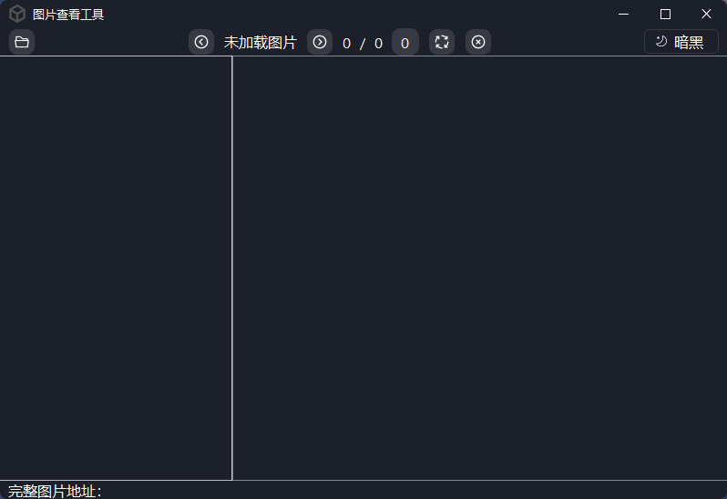
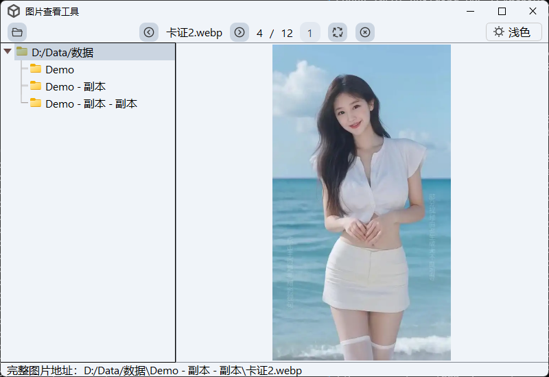

<h1 align="center">图片查看工具</h1>

## 打包可执行文件
- Windows
    ```bash
    pyinstaller -Fw -i assets/image/logo.ico --path . app.py --clean --version-file assets/version/version.txt -n ImageView
    ```

- Linux
    ```bash
    pyinstaller -Fw -i assets/image/logo.png --path . app.py --clean --version-file assets/version/version.txt -n ImageView
    ```

- MacOS
    ```bash
    pyinstaller -Fw -i assets/image/logo.icns --path . app.py --clean --version-file assets/version/version.txt -n ImageView
    ```

## 快捷键
 - `Left` 查看上一张图片
 - `Right` 查看下一张图片
 - `Delete` 删除图片
 - `R` 旋转图片
 - `Ctrl / Shift` 任选其一可多选
 - `Ctrl + O` 选择目录
 - `鼠标双击` 图片自适应窗口

## 示例图

| 暗黑主题 | 浅色主题 |
| :-----: | :-----: |
|  |  |